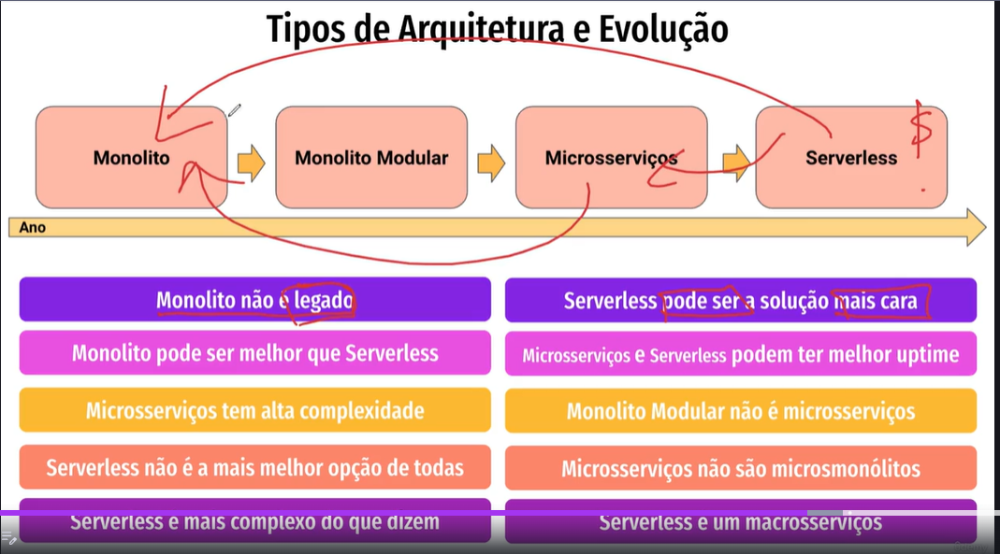

# Tipos de Arquitetura e Evolução

---

#### 1. Tipos de Arquitetura de Software
- **Monolito:** Aplicação única que contém todos os módulos em um único servidor.
    - *Vantagens:* Simplicidade no desenvolvimento inicial.
    - *Desvantagens:* Desafios em escalabilidade, manutenção e disponibilidade; falhas afetam toda a aplicação.

---

#### 2. Evolução da Arquitetura
- Transição para arquiteturas mais modulares, permitindo separação de componentes.
- **Microserviços:** Componentes independentes que se comunicam via protocolos ou eventos.
    - Cada microserviço possui seu próprio banco de dados e contexto.
    - *Vantagens:* Flexibilidade, escalabilidade.
    - *Desvantagens:* Complexidade na gestão e comunicação.

---

#### 3. Servless
- Abstrai a gestão de servidores em ambientes gerenciados (ex: nuvem).
    - *Vantagens:* Escalabilidade e facilidade de gerenciamento.
    - *Desvantagens:* Complexidade e custos podem aumentar dependendo do uso.

---

#### 4. Escolha da Arquitetura
- Não existe uma arquitetura única ideal; a escolha depende das necessidades do negócio e requisitos técnicos.
- O monolito ainda é uma solução válida em muitos contextos.
- Microserviços e servless devem ser avaliados conforme as exigências de cada projeto.

---

#### 5. Complexidade das Arquiteturas Modernas
- É necessário considerar limites e escalabilidade em qualquer escolha arquitetural.
- Cada tipo de arquitetura possui benefícios e desvantagens; análise cuidadosa das necessidades é fundamental.
