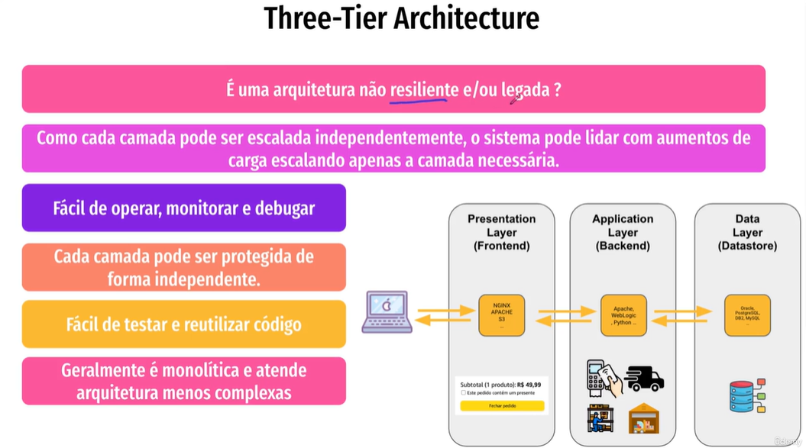

# Three-Tier Architecture

A arquitetura de três camadas (Three-Tier Architecture) organiza uma aplicação em três níveis principais, promovendo o desacoplamento das funcionalidades. Veja os principais pontos:

## Camadas da Arquitetura

- **Camada de Apresentação:** Responsável pela interação do usuário com o sistema, cuidando da interface e apresentação dos dados.
- **Camada de Negócio (ou Lógica):** Processa as regras de negócio e a lógica da aplicação, realizando operações e manipulação de dados.
- **Camada de Dados:** Gerencia o banco de dados e todo o acesso aos dados, sendo responsável pela persistência e recuperação das informações.

## Vantagens

- **Desacoplamento:** Cada camada pode ser desenvolvida, testada e escalada de forma independente, facilitando a flexibilidade e manutenção.
- **Melhor Organização:** As responsabilidades ficam claramente separadas, tornando o código mais organizado e fácil de manter.
- **Escalabilidade:** Permite escalar cada camada separadamente, otimizando o desempenho conforme necessário.

## Implementação

- A camada de apresentação pode ser desenvolvida com frameworks web.
- A camada de negócio pode utilizar servidores de aplicação.
- O acesso ao banco de dados pode ser feito via ORM (Object-Relational Mapping) ou consultas diretas, conforme a necessidade do projeto.

## Considerações

- Avalie a granularidade dos serviços e as interações entre as camadas.
- Alinhe a escolha da arquitetura com os objetivos do negócio e as necessidades do sistema.