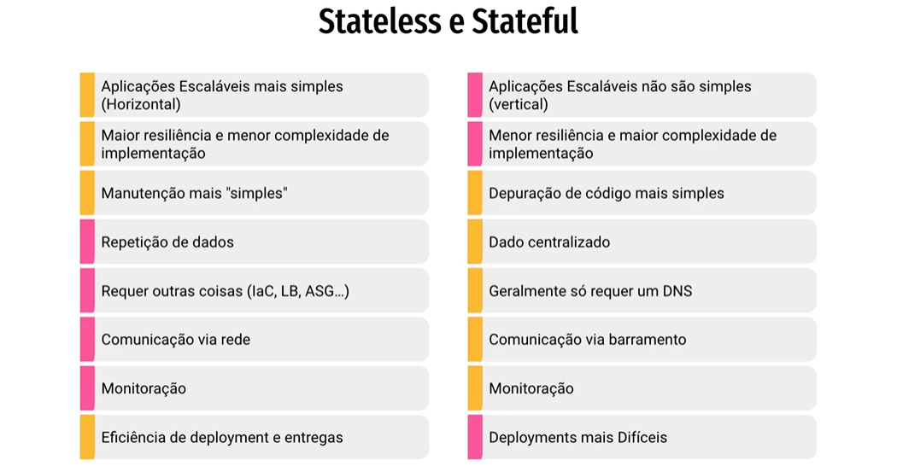

# Stateless, Stateful e Imutabilidade

---
## Stateless

Aplicações **stateless** não mantêm estado entre requisições. Cada solicitação é independente, e o servidor não armazena informações sobre conexões anteriores.

[Veja também: Notas sobre servidores](#notas)  

**Vantagens:**  
- Maior escalabilidade  
- Gerenciamento de sessões simplificado  
- Menor complexidade, facilitando a distribuição

## Stateful

Aplicações **stateful** mantêm o estado do usuário entre requisições, geralmente por meio de sessões armazenadas no servidor.  
**Desafios:**  
- Maior complexidade no gerenciamento do estado  
- Dificuldade de escalar em ambientes distribuídos

## Imutabilidade

**Imutabilidade** significa que um objeto, uma vez criado, não pode ser alterado.  
**Benefícios:**  
- Segurança dos dados  
- Evita efeitos colaterais indesejados  
- Facilita a concorrência, pois múltiplas threads podem acessar os dados sem conflitos

---

Esses conceitos são fundamentais para o design de sistemas robustos e eficientes, auxiliando na escolha das melhores estratégias para gerenciamento de informações e integridade dos dados durante o desenvolvimento.

---

##### Notas:
- Um servidor, em informática, é um computador ou sistema que fornece recursos e serviços a outros computadores (clientes) em uma rede, seja local ou remota. Ele atua como intermediário, gerando dados, processando informações e executando aplicações. Sem servidores, muitos dos serviços online que utilizamos, como e-mails, websites e armazenamento em nuvem, seriam impossíveis.
- Em resumo:  
    - Funciona como um "garçom": atende às requisições dos clientes (computadores) na rede.  
    - Proporciona serviços: armazenamento de dados, execução de aplicações, acesso a recursos, etc.  
    - Fundamento da internet e redes: é essencial para a comunicação e acesso a informações em larga escala.
- Tipos de servidores:  
    - Web: hospedam sites e aplicações web, disponibilizando conteúdo para navegadores.  
    - E-mail: gerenciam a troca de e-mails.  
    - Banco de dados: armazenam e gerenciam grandes quantidades de dados.  
    - Servidor de arquivos: permitem o acesso e compartilhamento de arquivos entre usuários.  
    - Servidor de backup: criam cópias de segurança de dados.  
    - Servidor de aplicações: executam e gerenciam aplicações específicas.
- Importância:  
    - Centralização de recursos: facilita a gestão e acesso a arquivos e recursos da empresa.  
    - Segurança e disponibilidade: garante a proteção e disponibilidade de dados, mesmo em caso de falhas.  
    - Eficiência: permite a execução de processos de forma mais eficiente e escalável.
