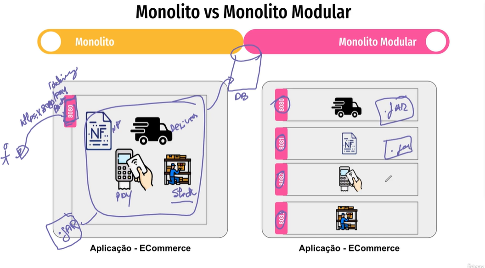

# Monolito vs Monolito Modular

## Definição de Monolito

Uma aplicação monolítica é construída como um único bloco de código, centralizando todas as funcionalidades em um único repositório e binário. As camadas de apresentação, lógica de negócio e acesso a dados geralmente estão interligadas, e uma única instância controla todas as operações.

**Desvantagens do Monolito:**
- **Escalabilidade:** Pode ser difícil escalar partes específicas do sistema; uma falha pode afetar toda a aplicação.
- **Indisponibilidade:** Durante atualizações ou manutenções, toda a aplicação pode ficar indisponível.

## Monolito Modular

O monolito modular organiza a aplicação em módulos distintos, mantendo a centralização, mas permitindo melhor separação de responsabilidades. Cada módulo possui sua própria lógica, facilitando a implementação de novas funcionalidades sem impactar toda a base de código.

**Vantagens do Monolito Modular:**
- **Deploy Independente:** Possibilita testar e implementar módulos separadamente, minimizando a inatividade durante atualizações.
- **Menos Duplicação de Código:** A estrutura modular pode reduzir a repetição de código em comparação ao monolito tradicional.

## Considerações Finais

A transição de um monolito para um monolito modular pode ser um passo inicial antes de adotar uma arquitetura de microserviços. Embora o monolito modular se assemelhe a uma arquitetura baseada em serviços (SOA), existem diferenças fundamentais: o monolito modular permanece como uma única aplicação, beneficiando-se da modularização interna.
