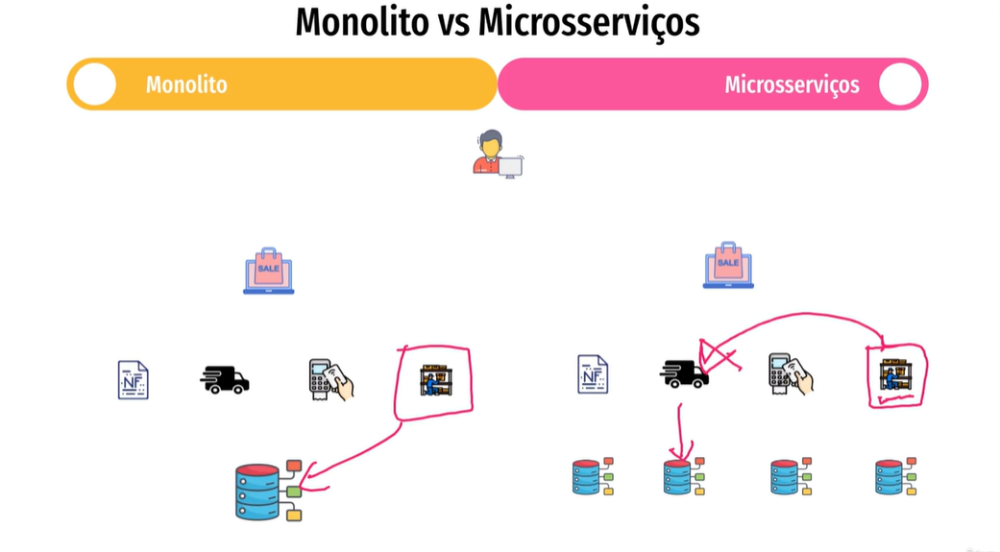
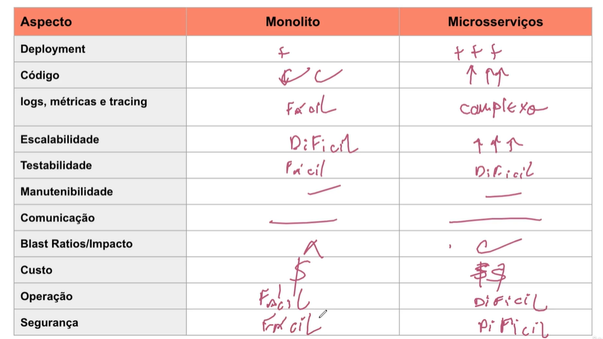

# Monolito vs Microserviços

## Definição de Monolito
Uma aplicação monolítica é construída como uma única unidade, onde todas as funcionalidades estão integradas em um único código-base. Isso pode facilitar o desenvolvimento e a implantação, pois tudo é realizado em um único deploy.

**Vantagens do Monolito:**
- **Simplicidade:** O desenvolvimento e a configuração são mais simples, com menos componentes para gerenciar.
- **Facilidade de Segurança:** Aplicar controles de segurança é mais fácil, pois existe um único ponto para implementação, ao contrário dos múltiplos serviços em microserviços.

**Desvantagens do Monolito:**
- **Escalabilidade Limitada:** A aplicação precisa ser escalada como um todo, o que pode ser ineficiente.
- **Mudanças Complexas:** Modificações e novas funcionalidades podem impactar todo o sistema, aumentando o risco de downtime.

---

## Definição de Microserviços
Na arquitetura de microserviços, a aplicação é dividida em serviços menores e independentes, que se comunicam entre si. Cada serviço é responsável por uma função específica.

**Vantagens dos Microserviços:**
- **Escalabilidade:** Serviços individuais podem ser escalados conforme a necessidade, otimizando o uso de recursos.
- **Desenvolvimento Ágil:** Permite desenvolver, testar e implantar serviços de forma independente, acelerando o ciclo de entrega.

**Desvantagens dos Microserviços:**
- **Complexidade Operacional:** Exige gerenciamento cuidadoso da infraestrutura e das comunicações entre serviços.
- **Duplicação de Código:** Pode haver lógica semelhante em diferentes serviços, aumentando o esforço de manutenção.

---

## Considerações Finais
A escolha entre monolito e microserviços deve considerar as necessidades do negócio. Monolitos são adequados para projetos menores ou equipes reduzidas, enquanto microserviços são vantajosos em sistemas que exigem maior escalabilidade e agilidade.

Essa comparação é fundamental para decidir a arquitetura mais adequada ao seu projeto.

